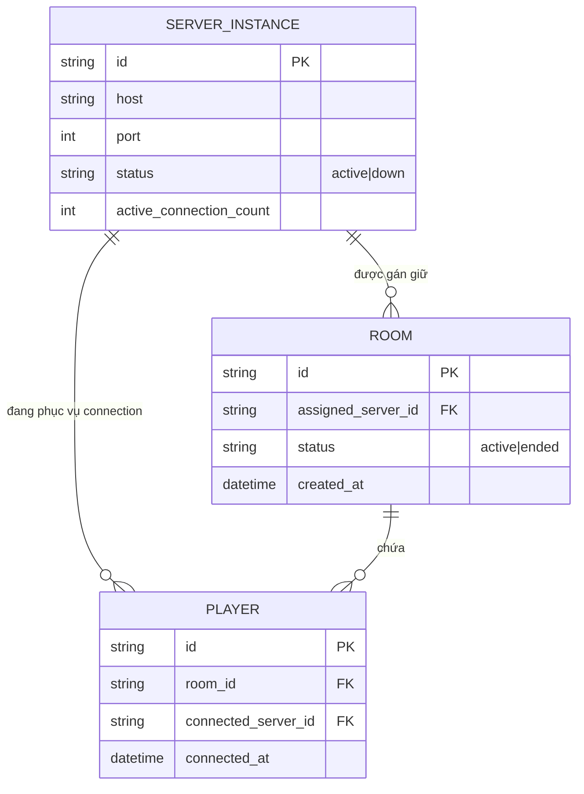

# Base ERD — Matchmaking server trước khi có consistent hashing theo room

Đây là **base**: trạng thái backend game multiplayer *trước khi* áp dụng consistent hashing theo `room_id`. Suy luận từ đề bài, base đã có `SERVER_INSTANCE` (các game server trong cluster), `ROOM` (được gán vào 1 server khi tạo, nhưng gán theo cách đơn giản như round-robin/random dựa trên số connection), và `PLAYER` kết nối vào 1 server cụ thể. Base chưa có khái niệm lease/ownership có TTL, chưa có snapshot phục hồi state, và load balancing chỉ dựa trên số connection chứ chưa tính theo số room active.

