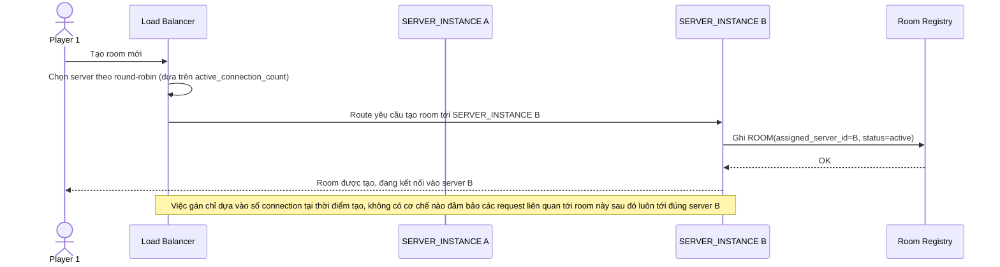

# Base sequence — Create room (gán server bằng round-robin đơn giản)

Đây là **base**, flow tạo room ở trạng thái hiện tại: load balancer chọn server instance để giữ room bằng round-robin/random dựa trên số connection hiện có, không dùng consistent hashing theo `room_id`. Flow này là tiền đề để so sánh với yêu cầu 1 và yêu cầu 4 của đề bài (gán cố định qua hashing, cân bằng theo số room chứ không phải số connection).

