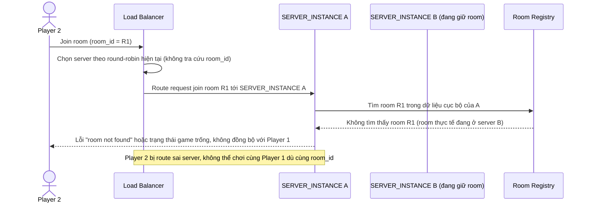

# Base sequence — Join room (misrouting vì LB route độc lập từng request)

Đây là **base**, flow người chơi thứ 2 join vào room đã tồn tại. Vì load balancer route độc lập từng request (không biết room đã được gán cho server nào), player join sau có thể bị route sai server, không thấy được state của room. Đây chính là vấn đề gốc mà yêu cầu 1 của đề bài (consistent hashing theo `room_id`) phải giải quyết.

