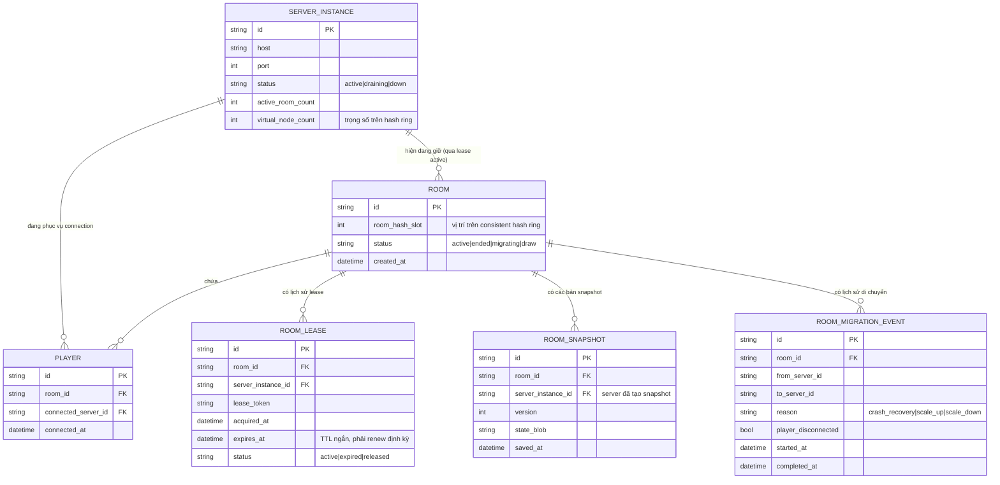

# Enhance ERD — Consistent hashing theo room, lease TTL, snapshot phục hồi

Đây là ERD **sau khi** enhance được áp dụng lên base. So với base, thêm mới:

- `SERVER_INSTANCE.active_room_count` và `virtual_node_count` — đáp ứng yêu cầu 4 (cân bằng tải theo số room active, có trọng số qua virtual node trên hash ring chứ không đếm connection).
- `ROOM.room_hash_slot` — vị trí room trên hash ring, dùng để mọi player join sau đều tra cứu ra đúng server, đáp ứng yêu cầu 1.
- Entity mới `ROOM_LEASE` (room_id, server_instance_id, lease_token, expires_at, status) — cơ chế ownership có TTL để chống split-brain, đáp ứng yêu cầu 3.
- Entity mới `ROOM_SNAPSHOT` (state_blob, version, saved_at) — lưu state gần nhất của room để phục hồi khi server crash giữa trận, đáp ứng yêu cầu 2.
- Entity mới `ROOM_MIGRATION_EVENT` — ghi lại mỗi lần room bị di chuyển giữa các server (do crash hoặc rebalance khi scale cluster), phục vụ đo đạc ở yêu cầu 5.

