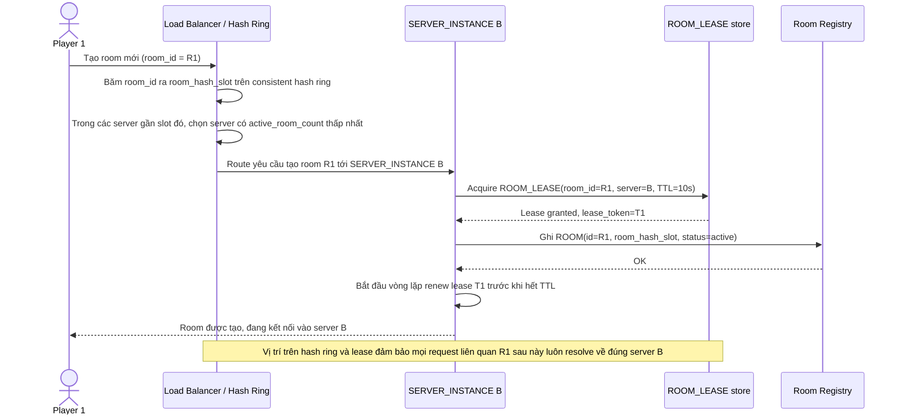

# Enhance sequence — Create room (consistent hashing + lease TTL + cân bằng theo số room)

Đây là **enhance** của flow `create-room` đã có ở base. So với base (round-robin theo connection), giờ đây: (1) vị trí room trên hash ring được tính từ `room_id` (yêu cầu 1), (2) server được chọn ưu tiên theo `active_room_count` thấp nhất trong nhóm ứng viên gần nhất trên ring, không phải theo connection count (yêu cầu 4), và (3) server phải giữ được `ROOM_LEASE` có TTL trước khi coi là chủ sở hữu room, đặt nền cho chống split-brain (yêu cầu 3).

