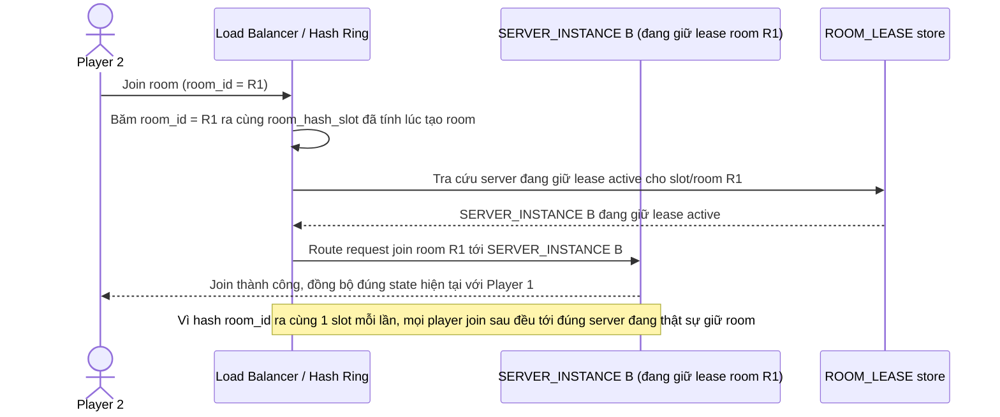

# Enhance sequence — Join room (route đúng server nhờ consistent hashing)

Đây là **enhance** của flow `join-room` đã có ở base. So với base (Player 2 bị route sai server vì LB không tra cứu room_id), giờ LB băm `room_id` ra đúng slot trên hash ring và route thẳng tới server đang giữ lease của room đó, đáp ứng trực tiếp yêu cầu 1 của đề bài — mọi player join sau đều tới đúng instance dù kết nối ở thời điểm khác nhau.

