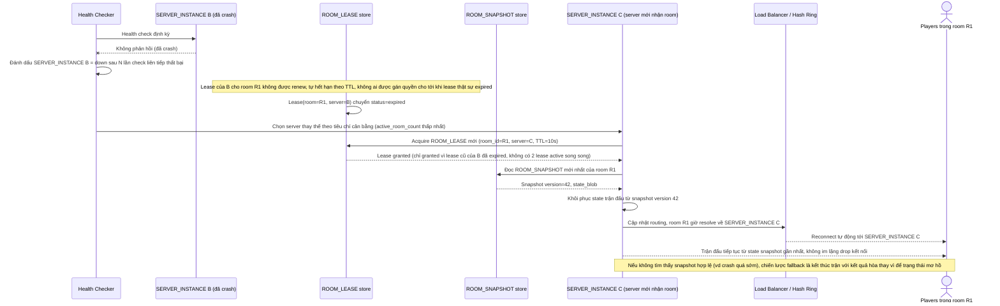

# Enhance sequence — Server crash giữa trận, failover an toàn nhờ lease TTL

Đây là **enhance**, flow hoàn toàn mới xử lý khi server đang giữ room bị crash giữa trận. Đáp ứng yêu cầu 2 (phát hiện qua health check, chiến lược rõ ràng là khôi phục từ snapshot gần nhất, không im lặng drop kết nối) và yêu cầu 3 (lease TTL hết hạn trước khi server khác được nhận quyền giữ room, tránh 2 server cùng tin mình giữ room do stale routing table).

