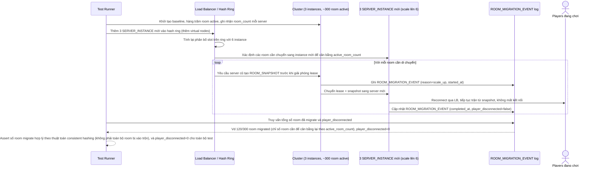

# Enhance sequence — Test scale cluster 3 → 6 instance, đo rebalance không disconnect

Đây là **enhance**, flow test mô phỏng mô tả ở yêu cầu 5 của đề bài: scale cluster từ 3 lên 6 instance khi đang có hàng trăm room active, đo số room bị di chuyển (rebalance) và xác nhận player không bị disconnect. Test này cũng xác nhận việc cân bằng tải theo số room active (yêu cầu 4) hoạt động đúng khi thêm instance mới.

