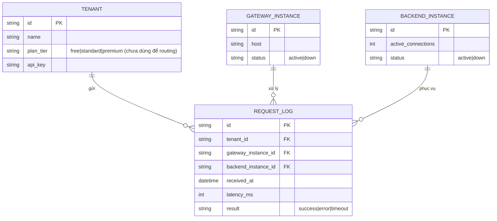

# Base ERD — API gateway chưa có giới hạn/tách biệt tài nguyên theo tenant

Đây là **base**: trạng thái API gateway *trước khi* áp dụng giới hạn tài nguyên và routing có trọng số theo tenant. Suy luận từ đề bài, base đã có `TENANT` (công ty khách hàng, xác định qua API key/JWT khi gọi request), nhiều `GATEWAY_INSTANCE` chạy song song đứng trước `BACKEND_INSTANCE`, và gateway chọn backend bằng thuật toán đơn giản (round-robin/least-connections) không quan tâm tenant nào đang gửi request. Base chưa có bất kỳ khái niệm quota, bộ đếm chia sẻ, hay trọng số theo gói dịch vụ nào.

