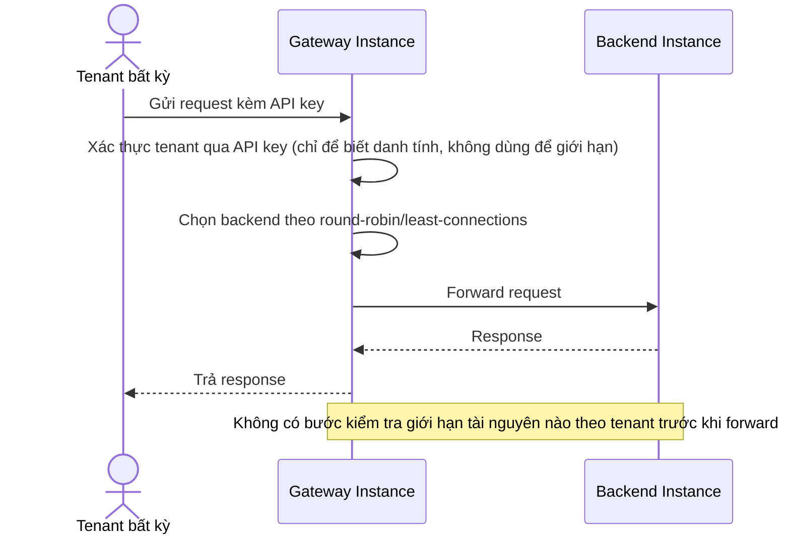

# Base sequence — Route request (round-robin, không phân biệt tenant)

Đây là **base**, flow route request hiện tại: gateway chọn backend instance bằng round-robin/least-connections, hoàn toàn không biết và không quan tâm request đến từ tenant nào. Flow này là tiền đề để so sánh với yêu cầu 1 và yêu cầu 4 của đề bài (giới hạn và trọng số theo tenant).

