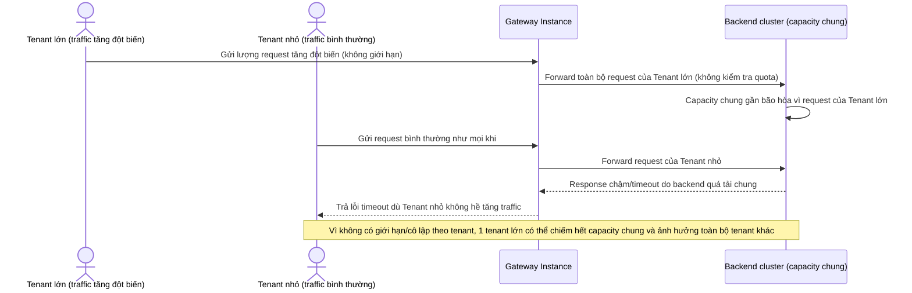

# Base sequence — Sự cố 1 tenant lớn làm nghẽn tenant khác (chưa có cô lập tài nguyên)

Đây là **base**, mô tả sự cố xảy ra khi chưa có giới hạn theo tenant: một tenant lớn tăng traffic đột biến, chiếm hết capacity chung của backend, khiến các tenant nhỏ khác cũng bị chậm/timeout dù họ không hề tăng traffic. Đây chính là vấn đề gốc mà toàn bộ đề bài (giới hạn, phân loại traffic, trọng số theo gói) phải giải quyết.

