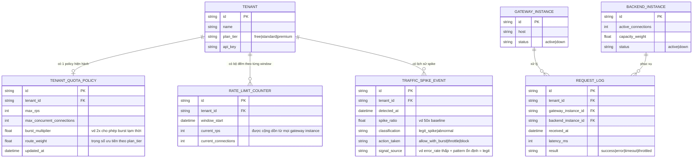

# Enhance ERD — Quota theo tenant, bộ đếm chia sẻ, trọng số theo gói dịch vụ

Đây là ERD **sau khi** enhance được áp dụng lên base. So với base, thêm mới:

- `TENANT_QUOTA_POLICY` (max_rps, max_concurrent_connections, route_weight theo `plan_tier`) — đáp ứng yêu cầu 1 (giới hạn tài nguyên độc lập với thuật toán chọn instance) và yêu cầu 4 (trọng số route theo gói dịch vụ, không cần tách backend vật lý riêng).
- `RATE_LIMIT_COUNTER` — bộ đếm request/connection theo tenant, đặt trong 1 store chia sẻ (vd Redis) chứ không lưu cục bộ ở từng `GATEWAY_INSTANCE`, đáp ứng yêu cầu 3 (đếm đúng khi có nhiều gateway instance chạy song song).
- `TRAFFIC_SPIKE_EVENT` — ghi nhận mỗi lần phát hiện traffic tăng đột biến của 1 tenant, kèm phân loại (legit_spike/abnormal) và action đã áp dụng, đáp ứng yêu cầu 2 (phân biệt spike hợp lệ với traffic bất thường).
- `BACKEND_INSTANCE.capacity_weight` — dùng cùng `TENANT_QUOTA_POLICY.route_weight` để phân bổ tài nguyên linh hoạt trên cùng 1 cụm backend, không tách instance riêng theo nhóm tenant.

