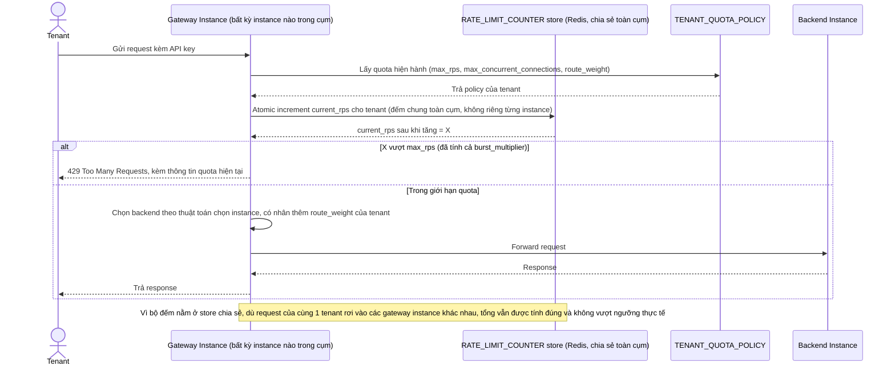

# Enhance sequence — Route request (kiểm tra quota qua bộ đếm chia sẻ trước khi chọn backend)

Đây là **enhance** của flow `route-request` đã có ở base. So với base (chỉ round-robin, không biết tenant), giờ gateway phải: (1) đọc `TENANT_QUOTA_POLICY` để biết giới hạn và trọng số, (2) tăng/kiểm tra `RATE_LIMIT_COUNTER` trong store chia sẻ (không lưu cục bộ) để đếm đúng dù có nhiều gateway instance chạy song song, và (3) chọn backend có tính tới `route_weight` của tenant. Đáp ứng yêu cầu 1, yêu cầu 3, và một phần yêu cầu 4.

