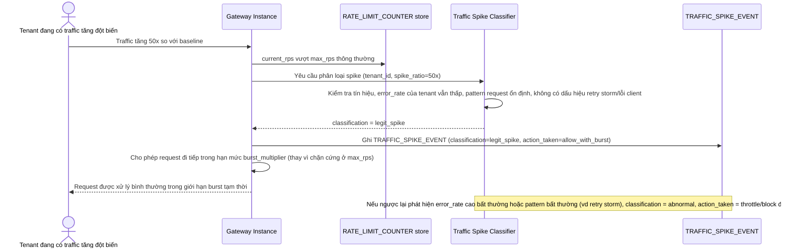

# Enhance sequence — Phân loại traffic spike hợp lệ vs bất thường

Đây là **enhance**, flow hoàn toàn mới xử lý khi 1 tenant vượt ngưỡng `max_rps` bình thường. Đáp ứng yêu cầu 2 của đề bài: phân biệt spike hợp lệ (tenant đang chạy chiến dịch riêng của họ) với traffic bất thường/lỗi client, để không chặn nhầm nhu cầu chính đáng nhưng vẫn bảo vệ tenant khác.

