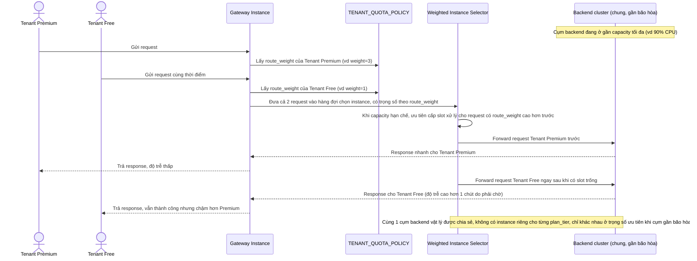

# Enhance sequence — Route có trọng số theo gói dịch vụ khi cụm gần bão hòa

Đây là **enhance**, flow mới tập trung vào yêu cầu 4 của đề bài: khi cụm backend gần đạt tải tối đa, tenant trả phí cao hơn (`plan_tier` = premium) được ưu tiên nhiều tài nguyên hơn qua `route_weight`, mà không cần tách riêng instance backend vật lý cho từng nhóm tenant.

