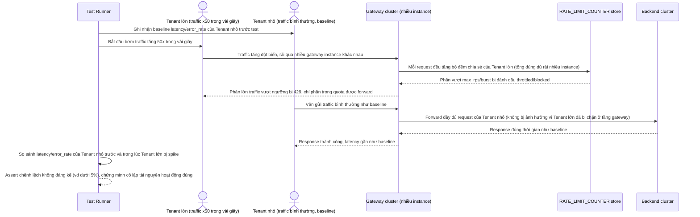

# Enhance sequence — Test 1 tenant tăng traffic 50x, đo ảnh hưởng tới tenant khác

Đây là **enhance**, flow test mô tả ở yêu cầu 5 của đề bài: mô phỏng 1 tenant tăng traffic đột biến 50 lần trong vài giây, đo độ trễ và tỷ lệ lỗi của các tenant khác trong cùng cụm, chứng minh giới hạn tài nguyên theo tenant (yêu cầu 1, 3) đã cô lập được ảnh hưởng. Đối lập trực tiếp với flow base `tenant-overload-incident` — cùng kịch bản traffic nhưng kết quả khác hẳn nhờ enhance.

