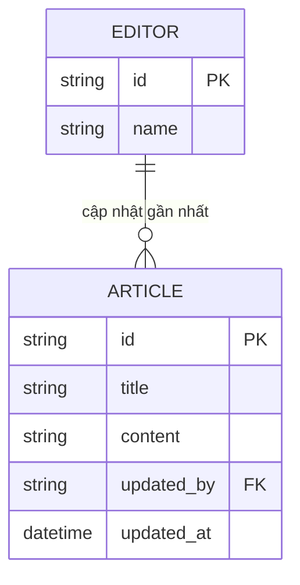

# Base ERD — CMS chưa có version, lưu bài viết ghi đè mù

Đây là **base**: trạng thái CMS *trước khi* áp dụng optimistic locking theo version. Suy luận từ đề bài, base đã có `EDITOR` (biên tập viên) và `ARTICLE` (bài viết) với nội dung cơ bản, nhiều editor có thể cùng mở 1 bài viết. Base chưa có cột `version`, chưa có lịch sử version, và mỗi lần lưu chỉ ghi đè trực tiếp `content` — ai lưu sau sẽ ghi đè hoàn toàn thay đổi của người lưu trước mà không phát hiện được.

