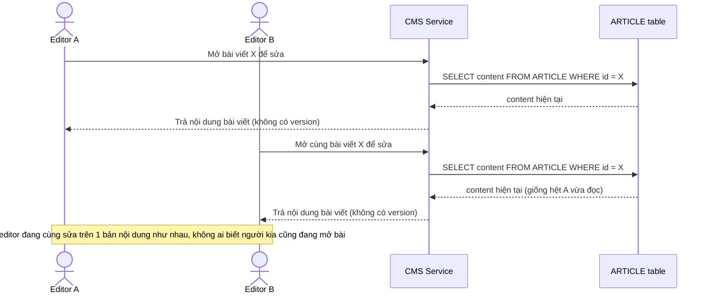

# Base sequence — Mở bài viết để sửa (không có khái niệm version)

Đây là **base**, flow mở bài viết hiện tại: editor mở bài, nhận toàn bộ nội dung hiện có, không có thông tin version đi kèm vì hệ thống chưa track version. Đây là tiền đề để so sánh với yêu cầu 1 (thêm cột version phải trả về khi mở bài để client gửi kèm lúc lưu).

