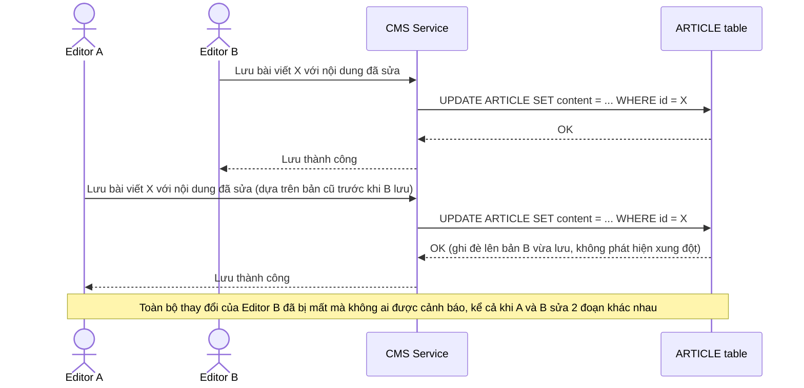

# Base sequence — Lưu bài viết (ghi đè mù, mất dữ liệu của người lưu trước)

Đây là **base**, flow lưu bài viết ở trạng thái hiện tại: không kiểm tra version, ai lưu sau sẽ ghi đè toàn bộ `content` của người lưu trước, kể cả khi 2 người sửa 2 phần nội dung khác nhau. Đây chính là vấn đề "lost update" mà toàn bộ đề bài (optimistic lock theo version) phải giải quyết.

