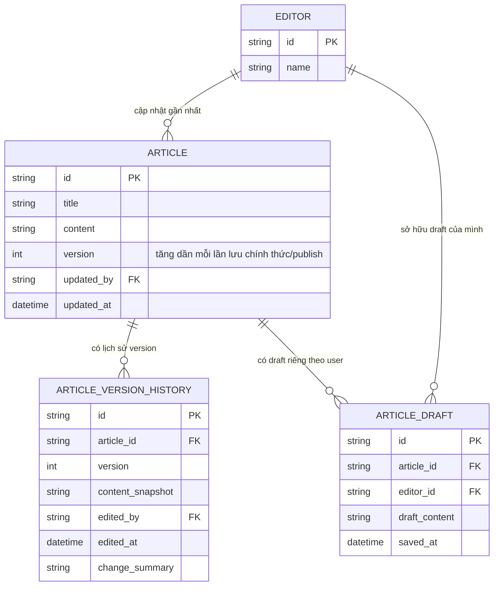

# Enhance ERD — Version, optimistic lock, draft riêng theo user, lịch sử version

Đây là ERD **sau khi** enhance được áp dụng lên base. So với base, thêm mới:

- `ARTICLE.version` — tăng dần mỗi lần lưu chính thức, đáp ứng yêu cầu 1 và yêu cầu 2 (điều kiện `WHERE version = 5` khi lưu, phát hiện xung đột).
- `ARTICLE_VERSION_HISTORY` (mới) — snapshot nội dung mỗi version, ai sửa/khi nào, đáp ứng yêu cầu 5 (xem lại/khôi phục version cũ). Cũng là nguồn dữ liệu để hiển thị nội dung version mới nhất khi conflict xảy ra (yêu cầu 2, 3).
- `ARTICLE_DRAFT` (mới) — draft riêng theo từng editor, tách biệt hoàn toàn khỏi `ARTICLE.version` chính thức, đáp ứng yêu cầu 4 (auto-save không được tính là lưu chính thức, không gây xung đột giả).

