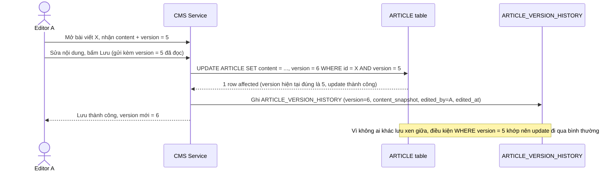

# Enhance sequence — Save article (optimistic lock theo version, ghi lịch sử)

Đây là **enhance** của flow `save-article` đã có ở base. So với base (ghi đè mù, không kiểm tra gì), giờ mọi request lưu phải gửi kèm `version` đã đọc, server chỉ chấp nhận nếu version hiện tại trong DB còn khớp (`UPDATE ... WHERE version = 5`), đồng thời ghi snapshot vào lịch sử. Đáp ứng trực tiếp yêu cầu 1 (trường hợp lưu thành công, không có xung đột) và tạo dữ liệu cho yêu cầu 5 (lịch sử version).

