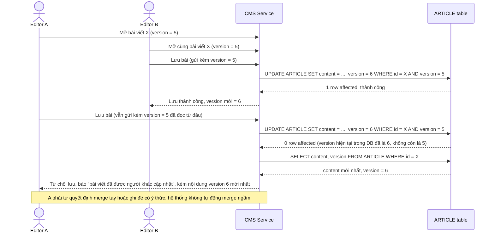

# Enhance sequence — Phát hiện xung đột khi lưu (version đã lỗi thời)

Đây là **enhance**, flow mới mô tả đúng kịch bản nêu trong yêu cầu 2 của đề bài: Editor A và B cùng mở bài ở version 5, B lưu trước (bài chuyển version 6), A lưu sau vẫn gửi version 5 — request của A phải bị từ chối rõ ràng, kèm hiển thị nội dung mới nhất (version 6), không tự động ghi đè.

