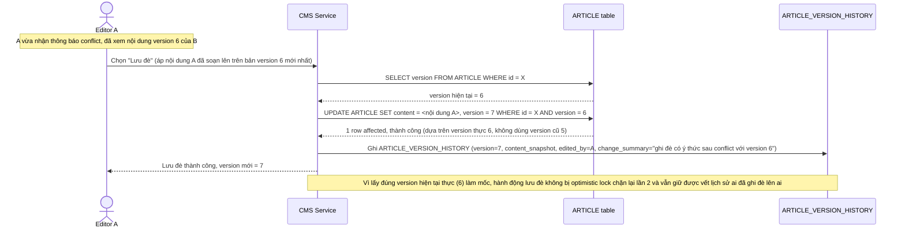

# Enhance sequence — Lưu đè có ý thức sau khi xem nội dung mới

Đây là **enhance**, flow tiếp nối trực tiếp sau `save-conflict-detected`, đáp ứng yêu cầu 3 của đề bài: sau khi Editor A đã xem nội dung mới nhất (version 6) của Editor B, A chọn "lưu đè có ý thức" — hành động này phải tạo version mới dựa trên version hiện tại thực (6 → 7), không dùng lại version cũ (5) đã lỗi thời.

