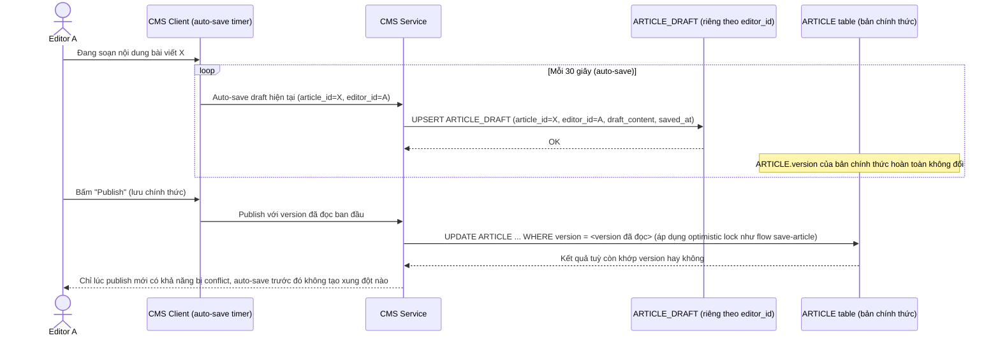

# Enhance sequence — Auto-save draft riêng theo user, không tăng version chính thức

Đây là **enhance**, flow hoàn toàn mới đáp ứng yêu cầu 4 của đề bài: trong lúc Editor đang soạn, hệ thống tự động lưu draft định kỳ vào `ARTICLE_DRAFT` riêng theo từng user, hoàn toàn tách khỏi `ARTICLE.version` chính thức — không gây xung đột giả với người khác đang sửa cùng bài.

