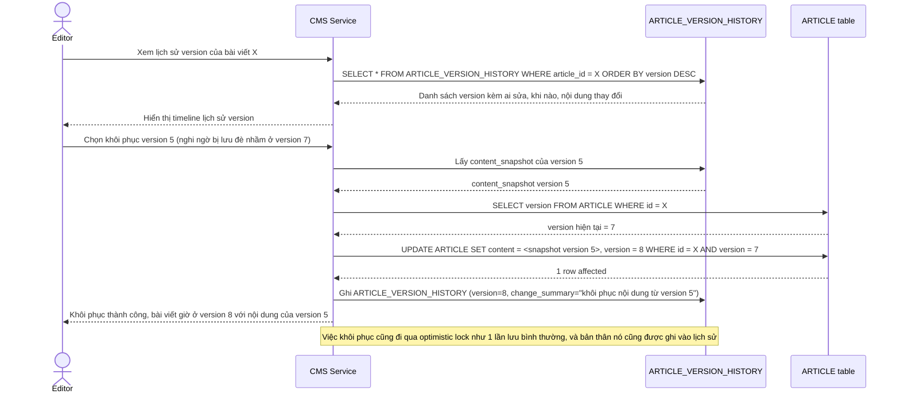

# Enhance sequence — Xem lịch sử version và khôi phục bản cũ

Đây là **enhance**, flow hoàn toàn mới đáp ứng yêu cầu 5 của đề bài: biên tập viên có thể xem lại lịch sử các version bài viết (ai sửa, khi nào, thay đổi gì) và khôi phục 1 version cũ nếu phát hiện bị lưu đè nhầm.

