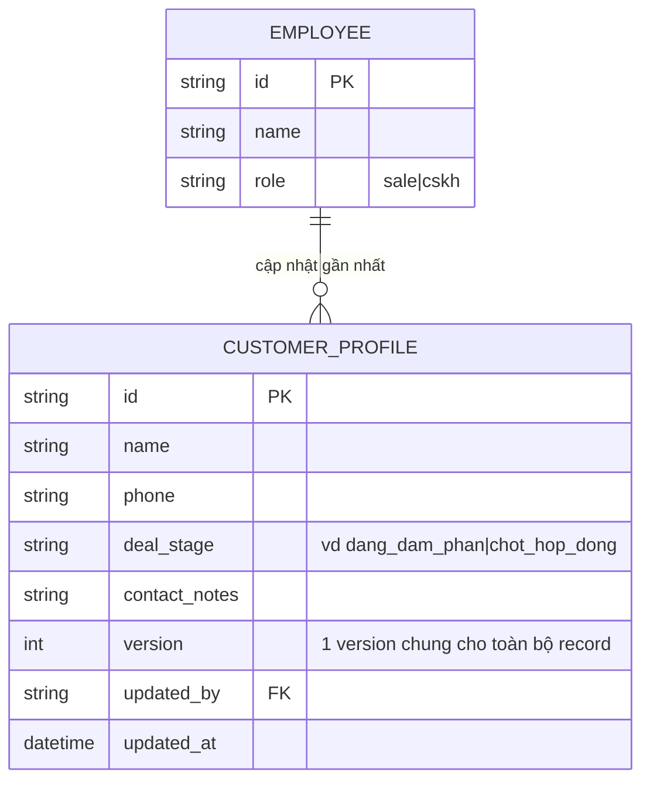

# Base ERD — CRM dùng optimistic lock ở cấp toàn bộ record

Đây là **base**: trạng thái CRM *trước khi* tách optimistic lock theo nhóm trường. Suy luận từ đề bài ("nếu dùng optimistic lock ở cấp toàn bộ record" được nêu như cách làm hiện tại), base đã có `EMPLOYEE` (sale hoặc CSKH) và `CUSTOMER_PROFILE` gộp chung mọi nhóm trường (thông tin chung, giai đoạn deal của sale, ghi chú của CSKH) trong 1 record với **1 cột `version` duy nhất cho toàn bộ hồ sơ**. Base chưa có lock riêng theo nhóm trường, chưa có pessimistic lock cho chuyển giao, và chưa ghi lịch sử chi tiết theo từng trường.

