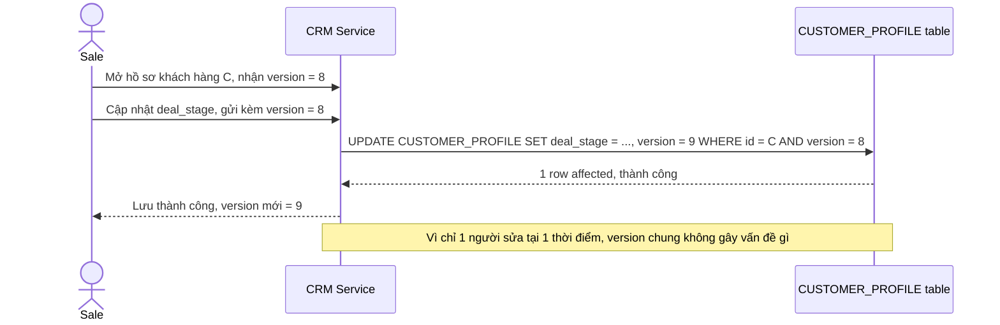

# Base sequence — Update profile (optimistic lock ở cấp toàn bộ record, thành công)

Đây là **base**, flow cập nhật hồ sơ khách hàng ở trạng thái hiện tại: optimistic lock áp dụng cho toàn bộ `CUSTOMER_PROFILE`, chỉ 1 cột `version` chung. Khi chỉ có 1 người sửa tại 1 thời điểm, flow hoạt động bình thường — đây là tiền đề để so sánh với flow tiếp theo khi 2 người sửa 2 nhóm trường khác nhau cùng lúc.

