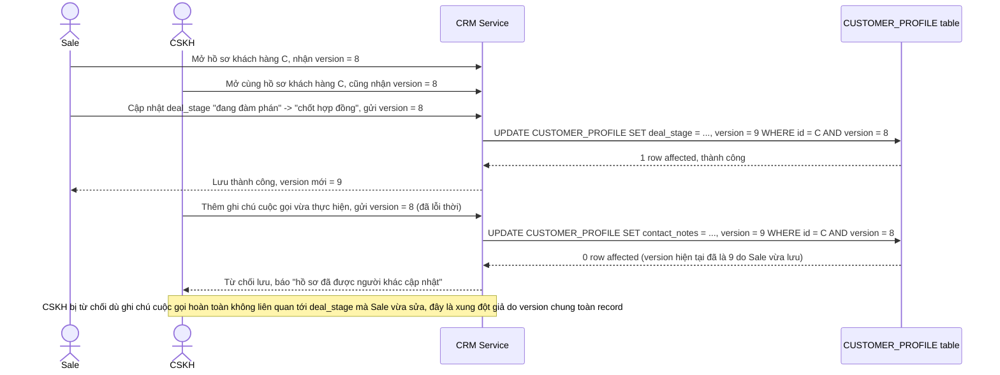

# Base sequence — Xung đột giả khi 2 người sửa 2 nhóm trường khác nhau

Đây là **base**, mô tả đúng kịch bản nêu ở yêu cầu 1 của đề bài: nhân viên sale mở hồ sơ C ở version 8, cập nhật giai đoạn deal; gần như cùng lúc nhân viên CSKH cũng mở hồ sơ C ở version 8, thêm ghi chú cuộc gọi. Vì optimistic lock ở cấp toàn bộ record, ai lưu sau sẽ bị từ chối dù 2 người sửa 2 nhóm trường hoàn toàn khác nhau — đây chính là vấn đề mà việc tách lock theo nhóm trường (enhance) phải giải quyết.

