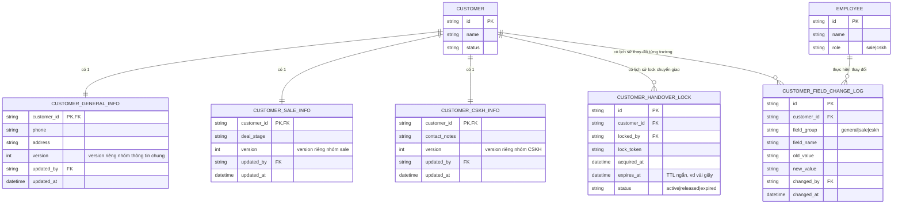

# Enhance ERD — Optimistic lock theo nhóm trường, pessimistic lock cho chuyển giao, audit log chi tiết

Đây là ERD **sau khi** enhance được áp dụng lên base. So với base (1 `version` chung cho toàn bộ record), thay đổi và bổ sung:

- Tách `CUSTOMER_PROFILE` thành 3 nhóm trường độc lập, mỗi nhóm có `version` riêng: `CUSTOMER_GENERAL_INFO` (thông tin chung, vd phone), `CUSTOMER_SALE_INFO` (deal_stage), `CUSTOMER_CSKH_INFO` (contact_notes) — đáp ứng yêu cầu 1 (loại bỏ xung đột giả) và là nền tảng cho yêu cầu 2 (vẫn phát hiện đúng xung đột thật khi cùng sửa 1 trường trong cùng 1 nhóm).
- Entity mới `CUSTOMER_HANDOVER_LOCK` (locked_by, lock_token, expires_at) — pessimistic lock có timeout ngắn cho thao tác chuyển giao khách hàng, tách biệt hoàn toàn với cơ chế optimistic mặc định, đáp ứng yêu cầu 3.
- Entity mới `CUSTOMER_FIELD_CHANGE_LOG` (field_group, field_name, old_value, new_value) — ghi lịch sử chi tiết theo từng trường, phục vụ yêu cầu 4 (chỉ rõ đúng trường/nhóm trường bị người khác thay đổi) và yêu cầu 5 (audit đầy đủ cho xử lý khiếu nại).

