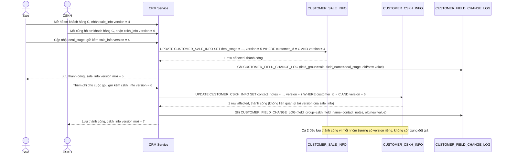

# Enhance sequence — Update profile (optimistic lock riêng theo nhóm trường, hết xung đột giả)

Đây là **enhance** của flow `update-profile`, áp dụng đúng lên kịch bản đã gây xung đột giả ở base (`concurrent-edit-false-conflict`). So với base (1 version chung), giờ Sale sửa `CUSTOMER_SALE_INFO` và CSKH sửa `CUSTOMER_CSKH_INFO` dùng 2 version độc lập, nên cả 2 đều lưu thành công. Đáp ứng trực tiếp yêu cầu 1 của đề bài.

