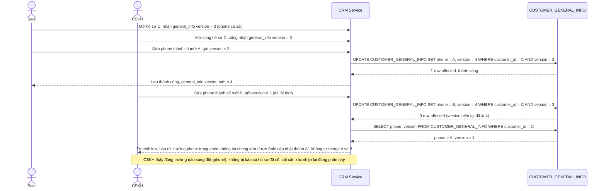

# Enhance sequence — Xung đột thật khi cùng sửa 1 trường trong cùng nhóm

Đây là **enhance**, flow mới đáp ứng yêu cầu 2 của đề bài: cả sale và CSKH cùng sửa số điện thoại liên hệ chính (cùng thuộc `CUSTOMER_GENERAL_INFO`) gần như đồng thời. Vì cùng 1 nhóm trường, optimistic lock ở đúng cấp nhóm phải từ chối người lưu sau, hiển thị đúng giá trị mới nhất, không tự động merge 2 số điện thoại thành 1 giá trị mơ hồ — cũng minh hoạ yêu cầu 4 (chỉ rõ đúng trường/nhóm bị đổi).

