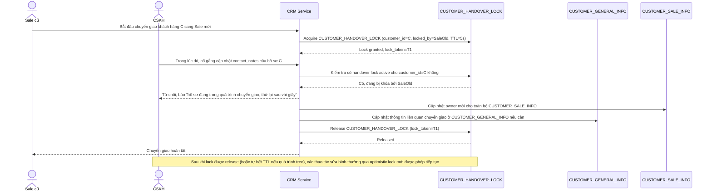

# Enhance sequence — Pessimistic lock khi chuyển giao khách hàng

Đây là **enhance**, flow hoàn toàn mới đáp ứng yêu cầu 3 của đề bài: khi chuyển giao khách hàng từ sale này sang sale khác, cần khóa cứng toàn bộ hồ sơ trong vài giây để không ai (kể cả CSKH) sửa bất kỳ trường nào giữa chừng — cơ chế khóa tường minh có timeout ngắn, tách biệt hẳn với optimistic lock mặc định dùng cho sửa thông thường.

