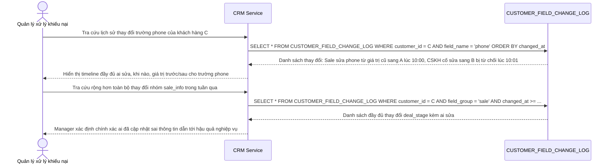

# Enhance sequence — Tra cứu lịch sử thay đổi từng trường để xử lý khiếu nại

Đây là **enhance**, flow hoàn toàn mới đáp ứng yêu cầu 5 của đề bài: mọi thay đổi hồ sơ khách hàng (theo từng nhóm trường) được ghi lịch sử đầy đủ ai sửa, khi nào, giá trị trước/sau, phục vụ tra cứu khi có tranh chấp nội bộ về việc ai đã cập nhật sai thông tin.

