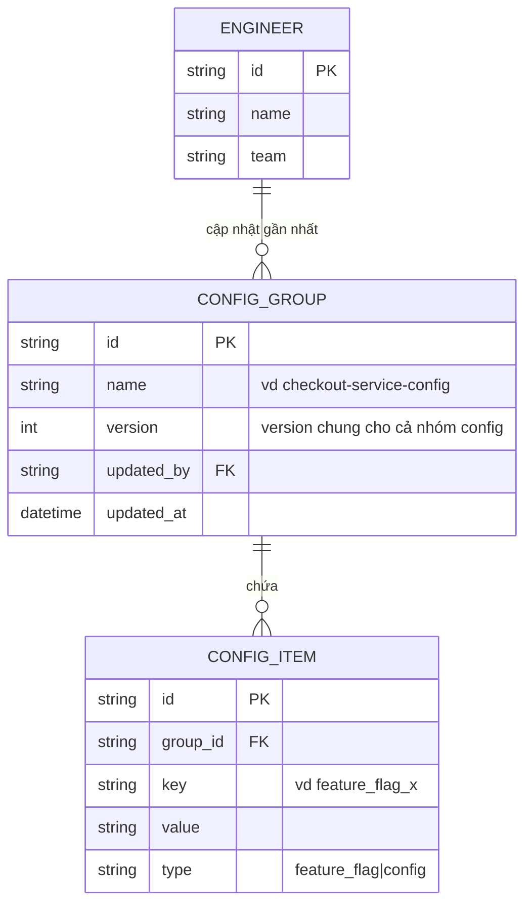

# Base ERD — Config dashboard dùng optimistic lock ở cấp cả nhóm config

Đây là **base**: trạng thái dashboard config nội bộ *trước khi* tách optimistic lock theo từng flag/config riêng lẻ. Suy luận từ đề bài (yêu cầu 2 mô tả rõ "version chung bị tăng do B lưu trước" như cách làm hiện tại), base đã có `ENGINEER`, `CONFIG_GROUP` (1 bộ config runtime liên quan nhau, vd cùng 1 service), và các `CONFIG_ITEM` (từng flag/config riêng lẻ) nằm trong group đó — nhưng cột `version` để optimistic lock nằm ở cấp `CONFIG_GROUP` chung cho cả nhóm, chưa có version riêng từng item. Base cũng chưa có đường xử lý khẩn cấp, chưa có audit log immutable, và chưa có cơ chế thông báo real-time.

