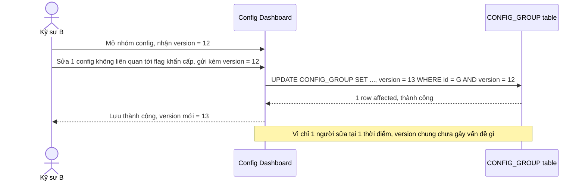

# Base sequence — Update config (optimistic lock ở cấp cả nhóm, thành công)

Đây là **base**, flow lưu thay đổi config hiện tại: optimistic lock áp dụng cho toàn bộ `CONFIG_GROUP`, chỉ 1 cột `version` chung cho mọi config/flag trong nhóm. Khi chỉ có 1 kỹ sư sửa tại 1 thời điểm, flow hoạt động bình thường — đây là tiền đề để so sánh với flow tiếp theo khi 2 kỹ sư sửa 2 config không liên quan trong cùng nhóm.

