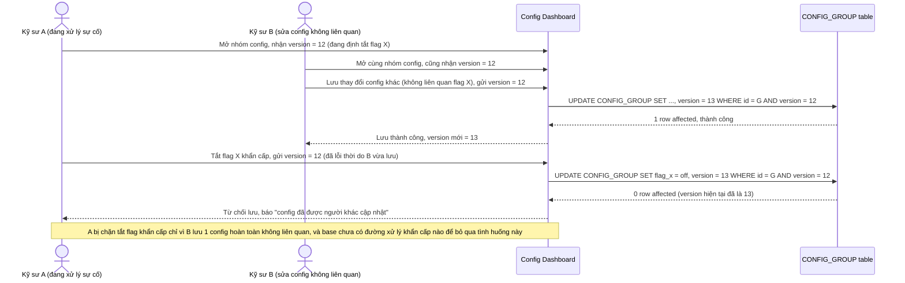

# Base sequence — Xung đột giả chặn cả thao tác khẩn cấp

Đây là **base**, mô tả đúng kịch bản nêu ở yêu cầu 2 của đề bài: kỹ sư A đang tắt feature flag X do phát hiện lỗi khẩn cấp, đúng lúc kỹ sư B đang sửa 1 config khác không liên quan trong cùng nhóm nhưng version chung bị tăng do B lưu trước. Vì optimistic lock ở cấp cả nhóm và base chưa có đường xử lý khẩn cấp, A bị chặn hoàn toàn — đây chính là vấn đề nghiêm trọng mà việc tách version theo từng item và thêm đường khẩn cấp (enhance) phải giải quyết.

