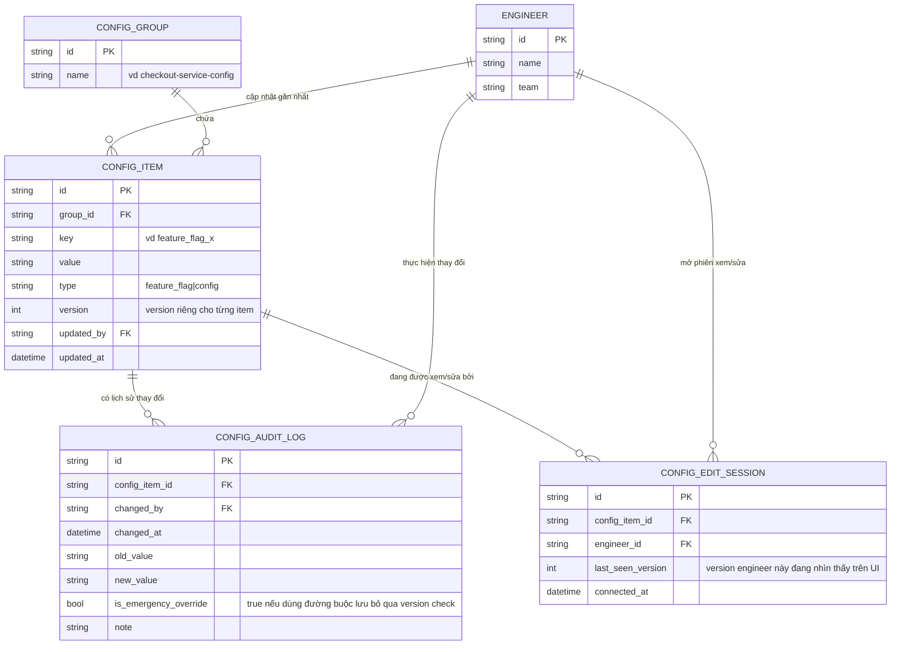

# Enhance ERD — Version theo từng config item, đường khẩn cấp, audit log immutable, notify real-time

Đây là ERD **sau khi** enhance được áp dụng lên base. So với base (`version` chung ở `CONFIG_GROUP`), thay đổi và bổ sung:

- `version` chuyển xuống cấp `CONFIG_ITEM` (mỗi flag/config riêng lẻ có version riêng) — đáp ứng yêu cầu 1 (conflict theo đúng item) và yêu cầu 2 (A tắt flag X không còn bị chặn bởi thay đổi không liên quan của B).
- `CONFIG_ITEM` thêm `is_emergency_override`/liên kết tới log để phân biệt lần lưu nào đã bấm "buộc lưu" — đáp ứng yêu cầu 3.
- Entity mới `CONFIG_AUDIT_LOG` (immutable, append-only, không có API xóa/sửa) — ghi mọi thay đổi kể cả qua đường khẩn cấp, đáp ứng yêu cầu 4.
- Entity mới `CONFIG_EDIT_SESSION` — theo dõi kỹ sư nào đang mở màn hình sửa config nào, làm nền cho việc đẩy thông báo real-time qua WebSocket/polling, đáp ứng yêu cầu 5.

