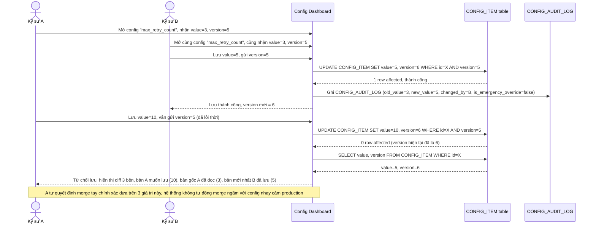

# Enhance sequence — Update config (conflict theo đúng item, hiển thị diff 3 bên)

Đây là **enhance** của flow `update-config` đã có ở base. So với base (chỉ báo chung chung "đã được cập nhật"), khi version của đúng `CONFIG_ITEM` đang sửa bị lệch, hệ thống phải hiển thị rõ diff giữa bản kỹ sư A đang muốn lưu, bản gốc A đã đọc, và bản mới nhất kỹ sư B đã lưu — đáp ứng đúng yêu cầu 1 của đề bài.

