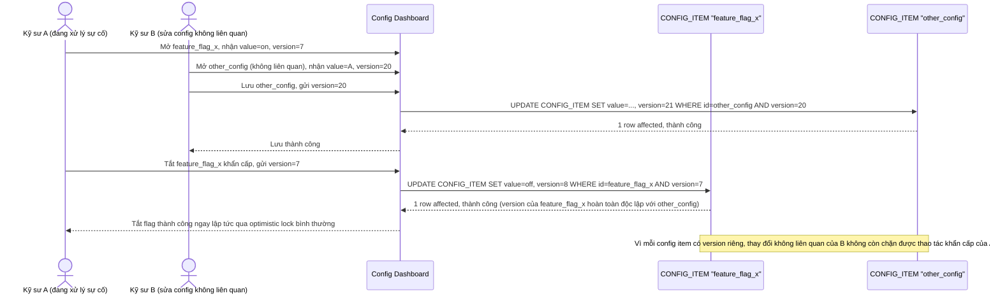

# Enhance sequence — Xung đột giả không còn xảy ra nhờ version theo từng item

Đây là **enhance** của flow `cross-flag-false-conflict-emergency` đã có ở base. So với base (A bị chặn tắt flag X chỉ vì B lưu 1 config không liên quan), giờ mỗi `CONFIG_ITEM` có version riêng nên B lưu config khác không hề ảnh hưởng tới version của flag X — A tắt được flag ngay qua optimistic lock bình thường, không cần tới đường khẩn cấp. Đáp ứng trực tiếp yêu cầu 2 của đề bài.

