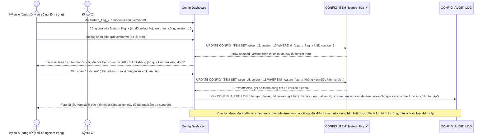

# Enhance sequence — Đường khẩn cấp "buộc lưu", bỏ qua version check

Đây là **enhance**, flow hoàn toàn mới đáp ứng yêu cầu 3 của đề bài: khi vẫn thực sự xảy ra conflict đúng ngay trên item cần tắt khẩn cấp (không chỉ là xung đột giả), kỹ sư có thể bấm "buộc lưu" để bỏ qua version check, ưu tiên tốc độ xử lý sự cố hơn rủi ro ghi đè nhầm — nhưng action này bắt buộc phải được log rõ ràng và cảnh báo.

