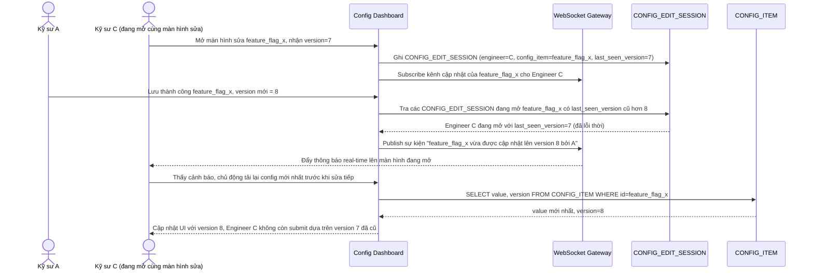

# Enhance sequence — Thông báo real-time khi có người vừa lưu thay đổi

Đây là **enhance**, flow hoàn toàn mới đáp ứng yêu cầu 5 của đề bài: các kỹ sư khác đang mở màn hình chỉnh sửa cùng 1 config được thông báo real-time (qua WebSocket) ngay khi có ai đó vừa lưu thay đổi, giảm khả năng họ submit dựa trên version đã lỗi thời.

