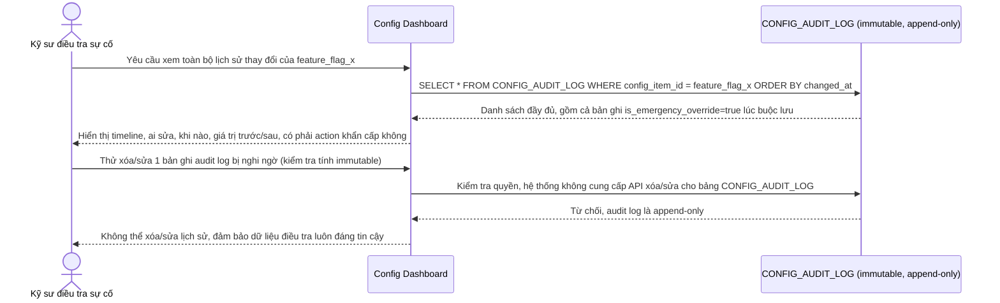

# Enhance sequence — Tra cứu audit log immutable để điều tra sự cố

Đây là **enhance**, flow hoàn toàn mới đáp ứng yêu cầu 4 của đề bài: mọi thay đổi config (dù qua optimistic lock thông thường hay đường khẩn cấp) đều được ghi vào `CONFIG_AUDIT_LOG` không thể xóa/sửa, phục vụ điều tra khi 1 thay đổi config gây ảnh hưởng không mong muốn.

