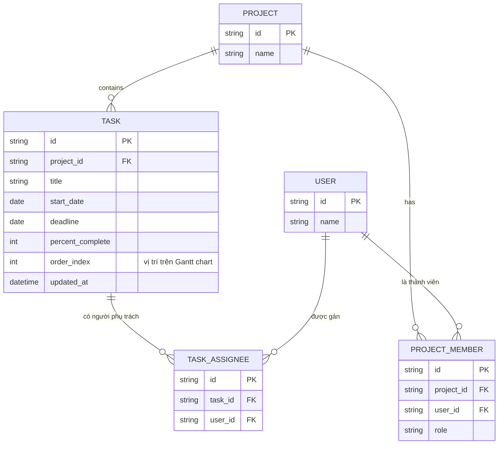

# Base ERD — Quản lý dự án chưa có cơ chế kiểm soát tương tranh

Đây là **base**: trạng thái tool quản lý dự án dạng Gantt chart *trước khi* áp dụng optimistic locking. Suy luận từ đề bài, base đã có `PROJECT` chứa nhiều `TASK`, mỗi task có thể có nhiều người phụ trách (`TASK_ASSIGNEE`), và `PROJECT_MEMBER` xác định ai là thành viên của dự án. Task đã có `deadline`, `percent_complete`, `order_index` để vẽ Gantt chart, nhưng chưa có trường `version` hay bất kỳ cơ chế phát hiện xung đột nào — hai người sửa cùng lúc sẽ ghi đè lẫn nhau (lost update).

