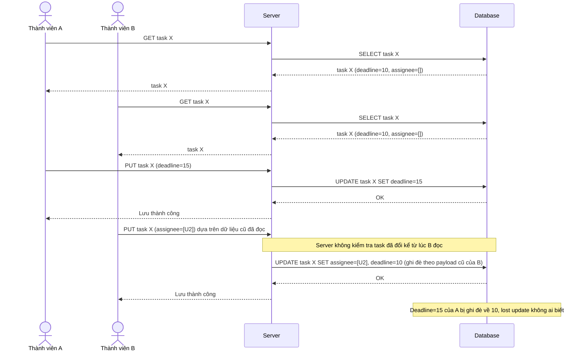

# Base sequence — Update task (không có kiểm soát tương tranh, lost update)

Đây là **base**, flow chỉnh sửa task hiện tại: server ghi đè trực tiếp theo dữ liệu request gửi lên, không kiểm tra task đã bị người khác sửa từ lúc mình đọc hay chưa. Đây chính là tiền đề cho vấn đề nêu ở yêu cầu 1 và 2 của đề bài — thành viên A đổi deadline và thành viên B gán thêm người phụ trách cho cùng task X, ai lưu sau sẽ ghi đè mất thay đổi hợp lệ của người lưu trước.

