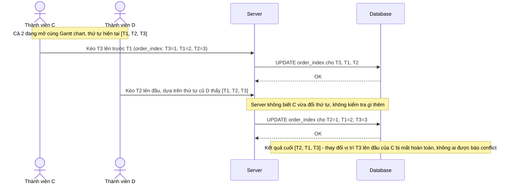

# Base sequence — Reorder tasks drag-drop (mỗi lần kéo thả ghi đè trực tiếp order_index)

Đây là **base**, flow kéo thả sắp xếp lại task trên Gantt chart: mỗi lần kéo thả gửi thẳng `order_index` mới xuống DB, không có version hay coalescing gì cả. Đây là tiền đề cho yêu cầu 3 của đề bài — khi 2 thành viên cùng kéo thả các task khác nhau nhưng cùng ảnh hưởng tới thứ tự chung, việc ghi đè trực tiếp liên tục dễ làm thứ tự cuối cùng bị sai lệch ngoài ý muốn.

