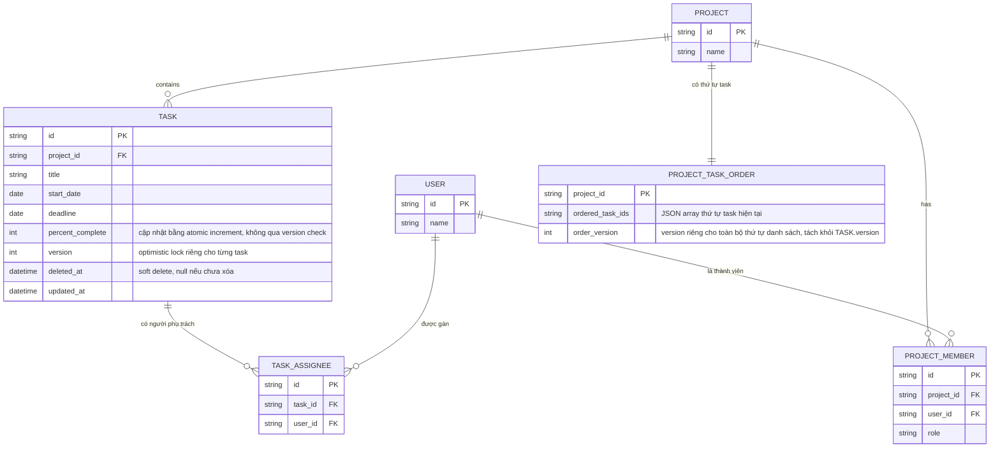

# Enhance ERD — Optimistic locking cấp task, order riêng cho danh sách, soft delete

Đây là ERD **sau khi** enhance được áp dụng lên base. So với base, thêm các trường/entity sau, ứng trực tiếp với từng yêu cầu:

- `TASK.version` — đáp ứng yêu cầu 1 (optimistic lock ở cấp độ từng task, không phải cấp dự án).
- `TASK.deleted_at` (soft delete thay vì xóa cứng) — đáp ứng yêu cầu 4 (phát hiện update lên task đã bị xóa để trả lỗi rõ ràng thay vì tạo lại hoặc lỗi mơ hồ).
- Entity mới `PROJECT_TASK_ORDER` với `order_version` riêng — đáp ứng yêu cầu 3 (tách version của "thứ tự toàn bộ danh sách" ra khỏi version của từng task, để kéo-thả không làm tăng version của task và không gây conflict giả khi 2 người kéo-thả các task khác nhau).
- `TASK.percent_complete` giữ nguyên kiểu, nhưng được cập nhật qua atomic increment ở DB thay vì qua optimistic lock — đáp ứng yêu cầu 5 (giảm tỷ lệ conflict phải retry cho trường bị tranh chấp cao). Không cần thêm cột mới, chỉ đổi cách ghi (xem sequence diagram tương ứng).

