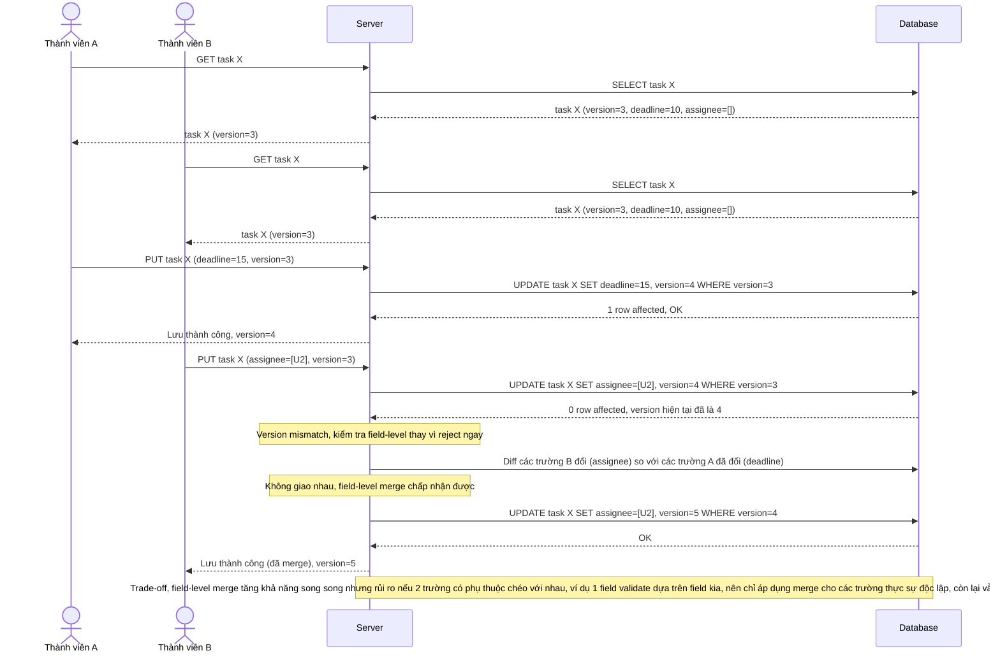

# Enhance sequence — Update task (optimistic lock cấp task + field-level merge)

Đây là **enhance** của flow `update-task` đã có ở base. So với base (ghi đè trực tiếp, lost update), nay mỗi update phải kèm `version` đã đọc; nếu version không khớp, hệ thống kiểm tra field-level thay vì từ chối toàn bộ ngay — nếu 2 request sửa các trường không giao nhau (A đổi deadline, B thêm assignee) thì merge cả hai vào bản ghi mới. Đáp ứng đúng kịch bản mô tả ở yêu cầu 1 và 2 của đề bài.

