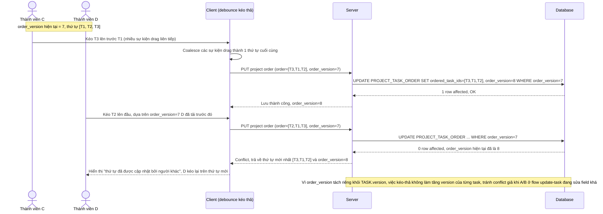

# Enhance sequence — Reorder tasks drag-drop (version riêng cho toàn bộ thứ tự danh sách)

Đây là **enhance** của flow `reorder-tasks-drag-drop` đã có ở base. So với base (mỗi lần kéo thả ghi đè `order_index` trực tiếp, không kiểm tra gì), nay toàn bộ thao tác kéo thả trong 1 phiên được coalesce thành 1 request cập nhật `ordered_task_ids` duy nhất, kiểm tra bằng `order_version` riêng biệt với `TASK.version` — không dùng optimistic lock ở cấp từng task cho việc sắp xếp. Đáp ứng yêu cầu 3 của đề bài.

