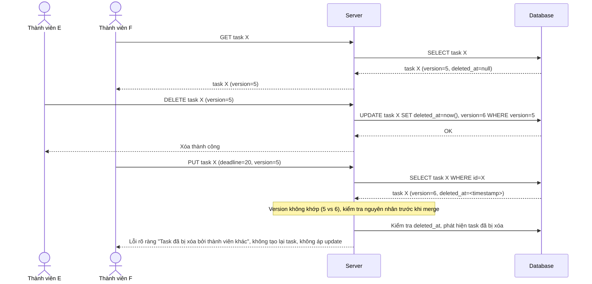

# Enhance sequence — Update task đã bị xóa (conflict rõ ràng, không tạo lại nhầm)

Đây là **enhance**, flow mới phát sinh từ đề bài, chưa có ở base (base chưa hỗ trợ xóa task nên chưa có kịch bản này). Khi thành viên E xóa task X (soft delete) đúng lúc thành viên F đang sửa task X dựa trên version cũ trước khi bị xóa, request update phải nhận lỗi rõ ràng "task đã bị xóa" thay vì tạo lại task hoặc báo lỗi version mismatch mơ hồ. Đáp ứng yêu cầu 4 của đề bài.

