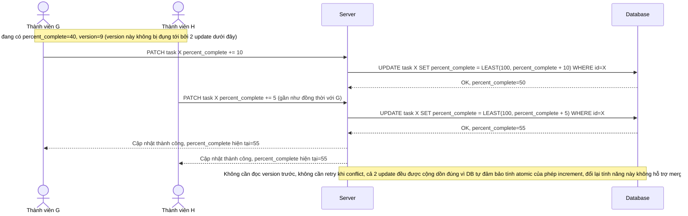

# Enhance sequence — Update percent_complete (atomic increment, bỏ qua optimistic lock)

Đây là **enhance**, flow mới phát sinh từ đề bài cho riêng trường `percent_complete` — trường có tần suất tranh chấp cao hơn hẳn các trường khác vì nhiều thành viên cùng cập nhật liên tục. Thay vì dùng optimistic lock như flow `update-task` (sẽ gây tỷ lệ conflict/retry rất cao cho trường này), hệ thống dùng atomic increment ở tầng DB, bỏ qua hoàn toàn kiểm tra version cho riêng trường này. Đáp ứng yêu cầu 5 của đề bài.

